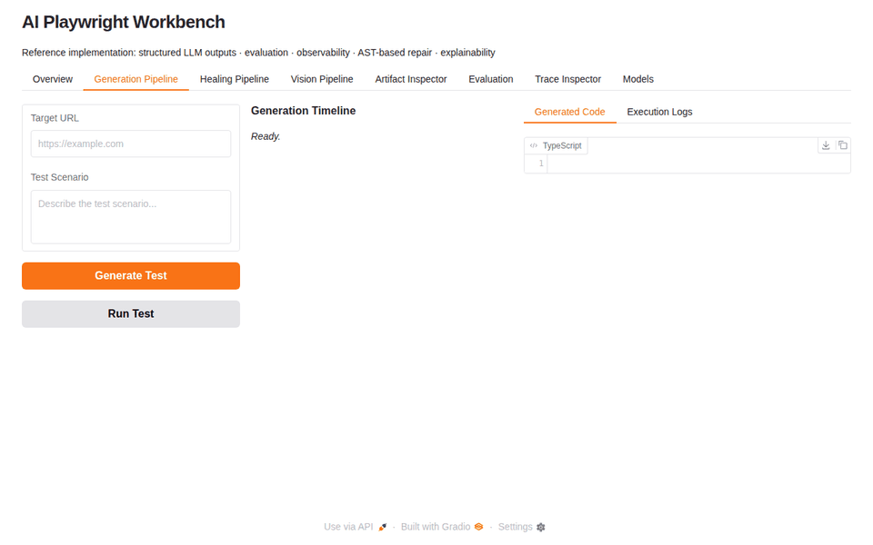
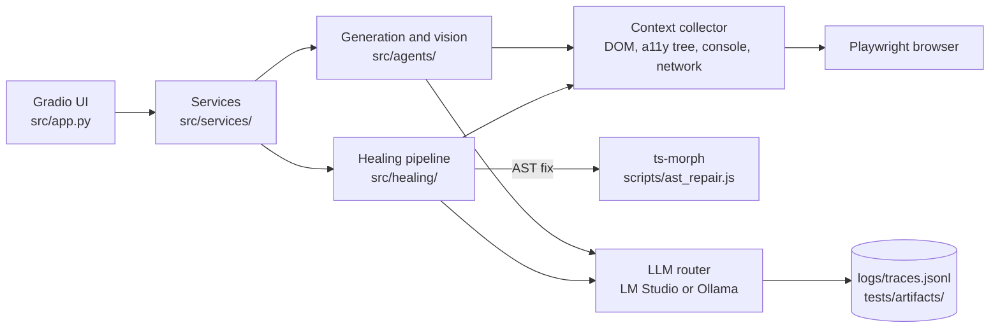
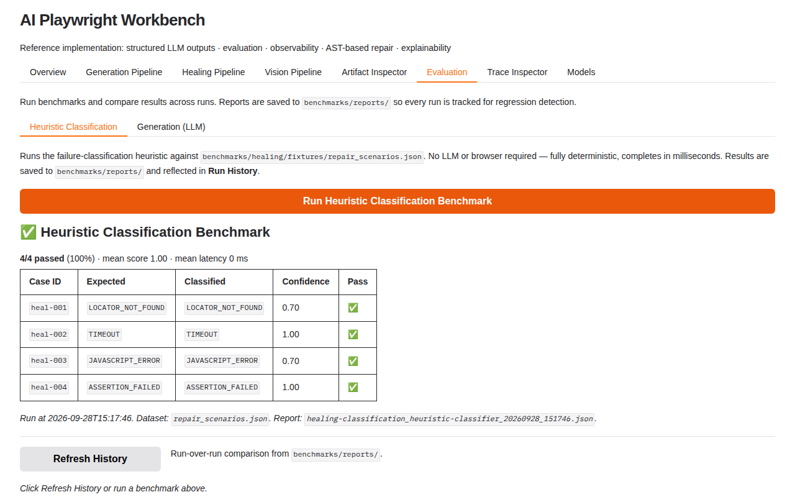

# ai-py-playwright-workbench

Generates, runs and self-heals Playwright tests with local LLMs, using structured outputs, AST-based code repair, benchmarks and JSONL traces.

[](https://github.com/yashwant-das/ai-py-playwright-workbench/actions/workflows/ci.yml)
[](https://github.com/yashwant-das/ai-py-playwright-workbench/actions/workflows/ci.yml)
[](LICENSE)
[](https://www.python.org/)
[](https://playwright.dev/)
[](https://www.typescriptlang.org/)
[](https://gradio.app/)



## Why it exists

Playwright tests break as UIs change, usually because a selector drifted, a timeout expired or an import moved, not because the product is broken. Fixing those failures is mechanical work. This workbench generates specs from a URL or a screenshot, and when a spec fails it classifies the failure, asks a local model for a fix, applies it to the TypeScript AST and re-runs the test. It also shows the plumbing an LLM pipeline needs to be trusted: Pydantic-validated outputs, benchmarks, traces and a decision record for every run.

## Architecture



The UI only calls the service layer; services run the generation and healing pipelines, which collect browser context in one Playwright session and call the local model through a router with retries and fallback. Every LLM call is traced, and every run writes a decision artifact.

## Quickstart

Prerequisites: Python 3.11, [uv](https://docs.astral.sh/uv/), Node.js 20, and a local model served by [LM Studio](https://lmstudio.ai/) (default) or [Ollama](https://ollama.com/).

```bash
git clone https://github.com/yashwant-das/ai-py-playwright-workbench.git && cd ai-py-playwright-workbench
uv sync
npm install
npx playwright install chromium
cp .env.example .env     # set LLM_PROVIDER and the model names for LM Studio or Ollama
uv run python src/app.py
```

The workbench opens at <http://127.0.0.1:7860>. Only one provider is active at a time; the variables are listed in [docs/env-variables.md](docs/env-variables.md), and a Docker setup is in [docs/docker.md](docs/docker.md).

The UI has eight tabs: Overview, Generation, Healing, Vision, Artifacts, Evaluation, Traces and Models. [docs/workbench-ui.md](docs/workbench-ui.md) walks through each one.

## Test reports and results

- CI runs ruff, mypy, the unit tests with coverage (reported in the job summary), tsc, ESLint and markdownlint on every push and pull request.
- A second CI job generates and heals specs against a real Chromium with a stubbed LLM, then re-runs them. The Playwright HTML report, generated specs, decision artifacts and traces are attached to the run as the `e2e-report` artifact: open the [latest CI run](https://github.com/yashwant-das/ai-py-playwright-workbench/actions/workflows/ci.yml) and download it.
- Locally, `uv run python -m pytest tests/unit_test_*.py -q` runs the unit tests with no model or browser, and `npm run test:generated` runs the specs the workbench generated.

### Benchmark results (2026-09-28, heuristic classifier, no LLM)

| Case       | Failure type        | Classified as       | Confidence | Result |
| ---------- | ------------------- | ------------------- | ---------- | ------ |
| `heal-001` | `LOCATOR_NOT_FOUND` | `LOCATOR_NOT_FOUND` | 0.70       | pass   |
| `heal-002` | `TIMEOUT`           | `TIMEOUT`           | 1.00       | pass   |
| `heal-003` | `JAVASCRIPT_ERROR`  | `JAVASCRIPT_ERROR`  | 0.70       | pass   |
| `heal-004` | `ASSERTION_FAILED`  | `ASSERTION_FAILED`  | 1.00       | pass   |

The generation benchmark (5 scenarios) and the full-repair healing benchmark need a local model, and their scores depend on which one you run, so they are not published here. Run them from the **Evaluation** tab or from Python ([docs/evaluation/benchmarks.md](docs/evaluation/benchmarks.md)); each run records model, prompt version and hash, temperature, seed and dataset version.



## Tech stack

| Layer              | Tool                                     | Version | Why                                                                                    |
| ------------------ | ---------------------------------------- | ------- | -------------------------------------------------------------------------------------- |
| UI                 | Gradio                                   | 6.28    | Streaming generators map onto Gradio's `yield`-based progress                          |
| Browser automation | Playwright (Python and Test)             | 1.57    | Context collection, and the runner for generated specs                                 |
| LLM client         | OpenAI SDK                               | 2.14    | LM Studio and Ollama both expose OpenAI-compatible APIs ([ADR-007](docs/decisions.md)) |
| Structured outputs | Pydantic                                 | 2       | Validates every model response against a schema ([ADR-001](docs/decisions.md))         |
| Code repair        | ts-morph, TypeScript                     | 28, 5.9 | Edits the spec's AST and keeps formatting ([ADR-003](docs/decisions.md))               |
| Observability      | Custom JSONL tracer                      | n/a     | No extra dependencies; queryable with `jq` ([ADR-004](docs/decisions.md))              |
| Quality gates      | ruff, mypy, pytest, ESLint, markdownlint | current | Same checks locally (`npm run lint`) and in CI                                         |

## Project structure

```text
├── src/
│   ├── app.py            # Gradio UI, wiring only
│   ├── services/         # UI-to-pipeline boundary
│   ├── agents/           # Generation entry points
│   ├── healing/          # Classifier, planner, AST repair, runner, verifier
│   ├── context/          # DOM, accessibility tree, console, network, screenshot
│   ├── llm/              # Router, client factory, model registry, retry policies
│   ├── observability/    # JSONL tracer
│   └── utils/            # Response parsing, prompt loading, validation
├── schemas/              # Pydantic data contracts
├── prompts/              # System prompts and manifest.json (versions)
├── benchmarks/           # Healing, generation and intent benchmarks, mutation engine
├── scripts/ast_repair.js # ts-morph repair script, run as a subprocess
├── tests/                # Unit tests, E2E pipeline test, fixtures
└── docs/                 # Architecture, ADRs, evaluation, development guides
```

The full module map is in [AGENTS.md](AGENTS.md).

## Documentation

- [docs/README.md](docs/README.md): reading paths through all the docs
- [docs/workbench-ui.md](docs/workbench-ui.md): the eight tabs, and calling the pipelines from Python
- [docs/architecture/overview.md](docs/architecture/overview.md): how the subsystems fit together
- [docs/decisions.md](docs/decisions.md): architecture decision records
- [docs/evaluation/benchmarks.md](docs/evaluation/benchmarks.md): benchmarks and how to run them
- [CONTRIBUTING.md](CONTRIBUTING.md): development setup and pull request checks

## License

MIT. See [LICENSE](LICENSE).
